제7회 Hallym SW Week C.愛.랑 동아리 전시회 출품작(동상)

powerAgent 스마트플러그

# 스마트 플러그 (Smart Plug)

ESP-12 모듈을 활용하여 제작한 스마트 플러그 프로젝트입니다.  
이 시스템은 전력 소비와 주변 환경 정보를 실시간으로 모니터링하고, 모바일 앱을 통해 원격 제어할 수 있습니다.

---

## 작품 개요
스마트 플러그는 전류 센서와 온도·습도 센서를 사용하여 데이터를 수집하고, 클라우드 서버로 전송합니다.  
사용자는 모바일 앱을 통해 데이터를 확인할 수 있으며, 다양한 방식으로 전력을 제어할 수 있습니다.  

이를 통해 소비 패턴을 시각화하고 자동 제어 기능을 구현하여 효율적이고 안전한 전력 관리를 제공합니다.

---

## 개발 도구
- 펌웨어 SW: Arduino (Platform IO, Clion IDE)  
- 회로/PCB: KiCad (Schematic, PCB)  
- 클라우드 서버: Azure Compute Engine (Ubuntu)  
- 데이터베이스: MySQL, phpMyAdmin  
- 앱 개발: React Native  
- 통신 프로토콜: MQTT  

---

## 주요 기능

### 전력 원격 모니터링
- 전류 센서를 통해 측정한 전력 데이터를 실시간으로 확인  
- 앱을 통해 원격으로 기기 제어 가능  

### 자동 제어 기능
- 스케줄링: 특정 시간대 자동 ON/OFF  
- 조건 제어: 온도·습도 값에 따른 동작  

### 모바일 앱 연동
- React Native 기반 앱에서 전력 데이터 확인  
- MQTT 프로토콜을 통한 양방향 통신 지원  

### 데이터 시각화
- 측정 데이터를 그래프 형태로 제공  
- 일별/월별 사용량 확인 가능  

---

## 실행 화면

### 모바일 앱 화면
| 화면 1 | 화면 2 |
|--------|--------|
| 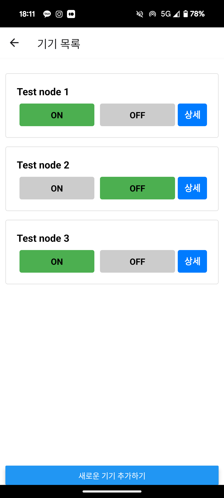 | 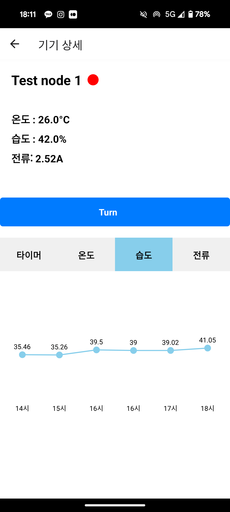 |

| 화면 3 | 화면 4 |
|--------|--------|
| 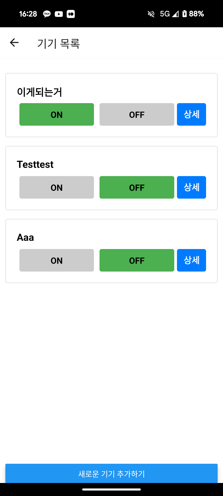 | 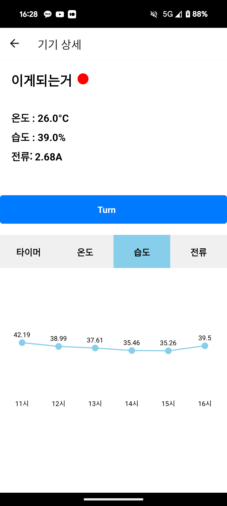 |

---

## 하드웨어 설계

### PCB 디자인
| Front | Back |
|-------|------|
|  | 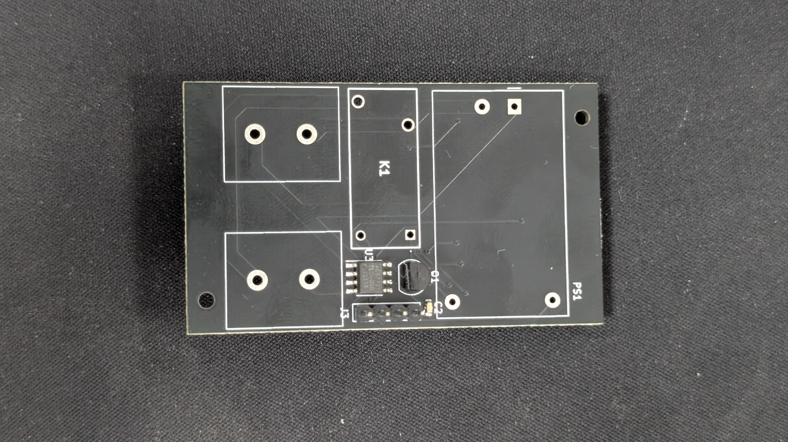 |

### PCB 조립

### 회로도 및 설계
- 스마트플러그 PCB: 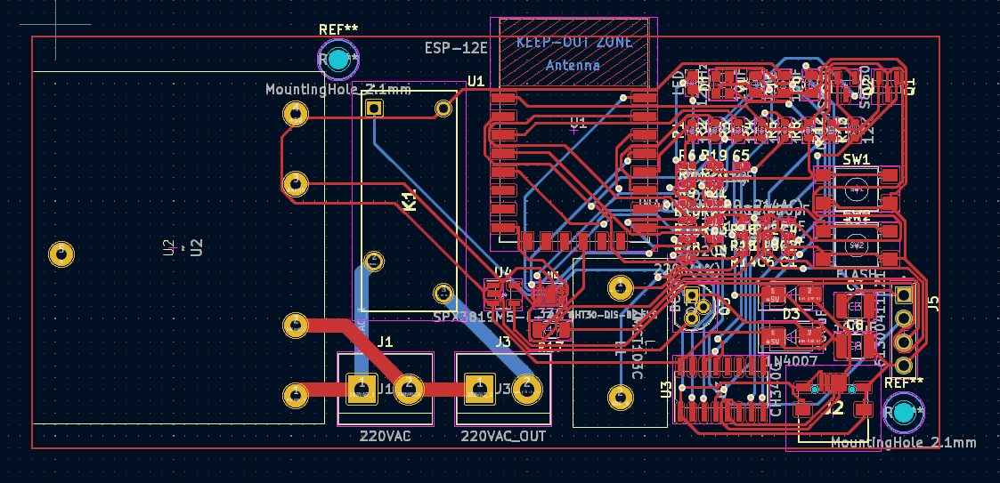  
- 릴레이 스위치: 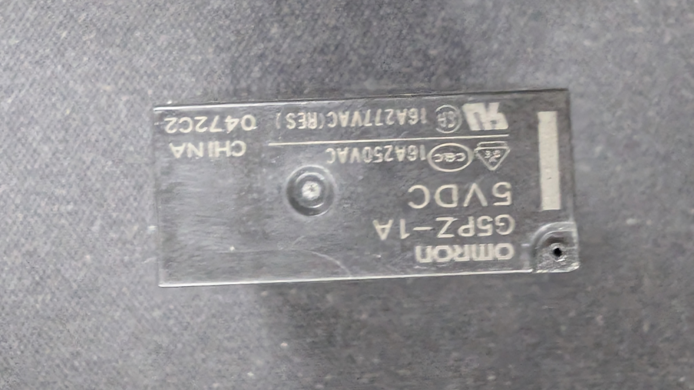  
- SMPS 모듈: 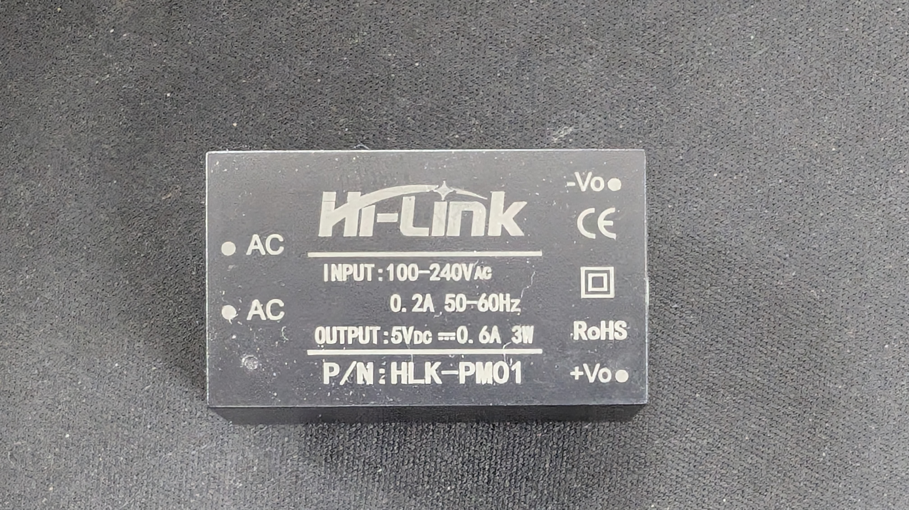  
- 전시: 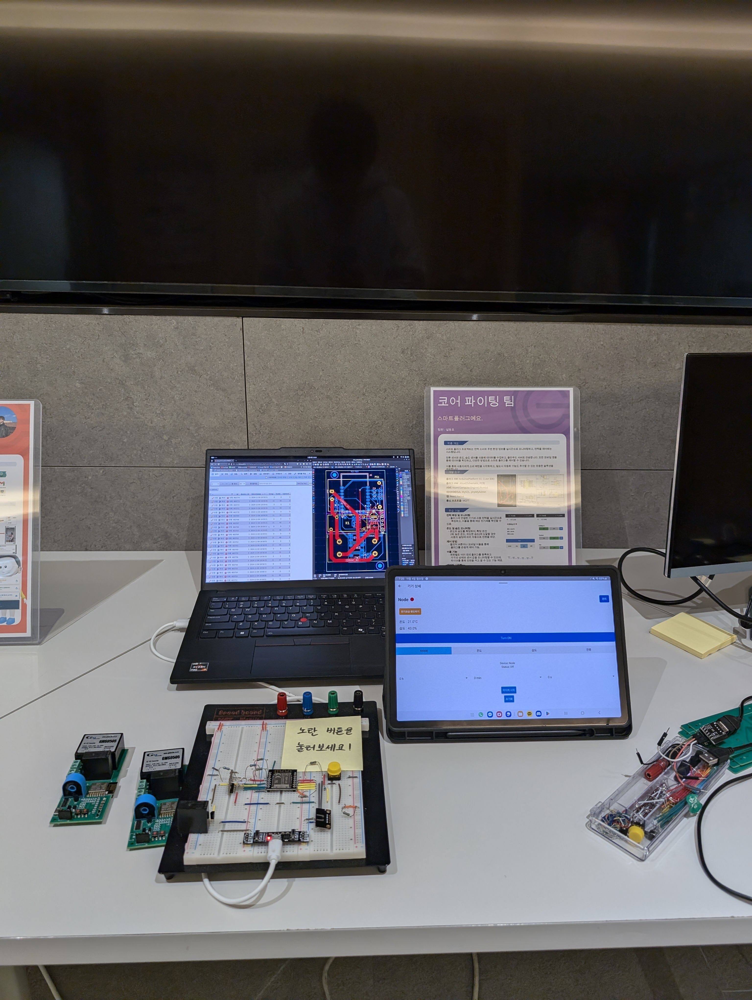  

### 구버전 PCB
| Old Front | Old Back |
|-----------|----------|
| 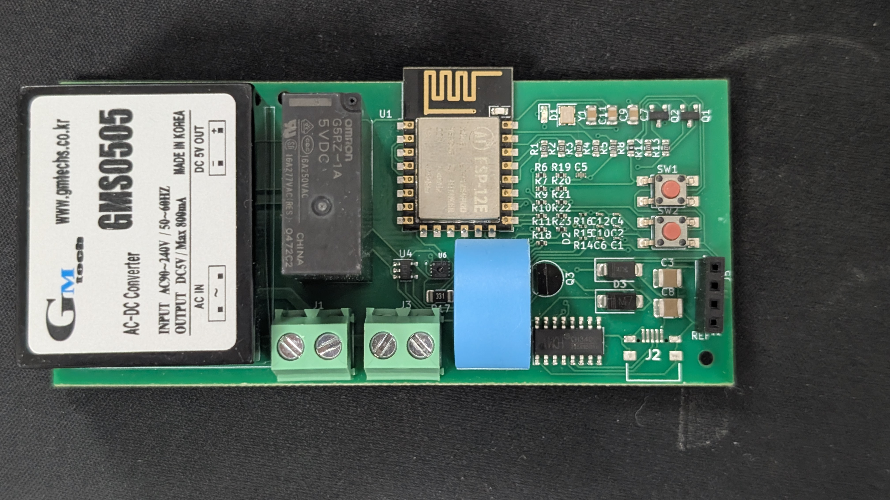 | 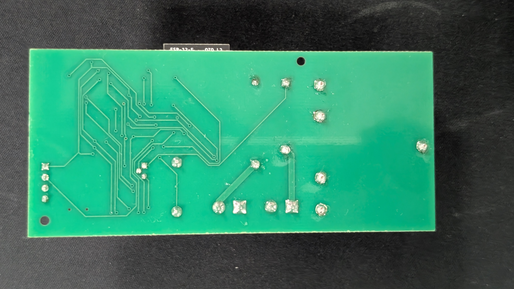 |

---

## 기대 효과
- 전력 사용 패턴 분석을 통한 에너지 절약  
- IoT 기반 스마트홈 구축  
- 안전한 전력 관리 (과부하 및 과열 방지)  

---

## 팀 정보
- 팀명: 코어 파이팅 팀  
- 팀원: 설동호
- 기여: 홍태성(tshong3, App과 DB)
